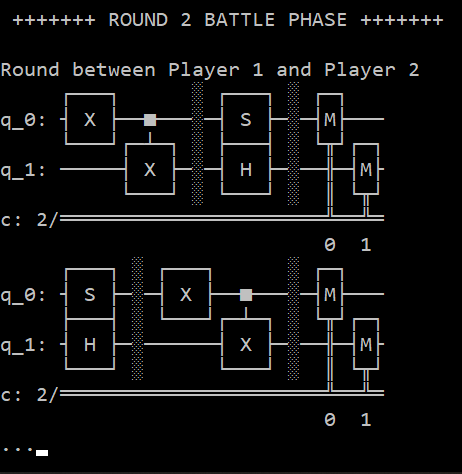
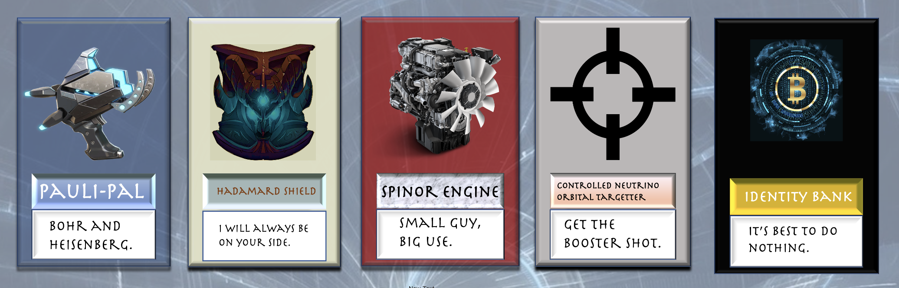

# Quantum Auto-Chess

  
  
  
  

[Repo to our Unity Implementation](https://github.com/nadinem100/iQuHackUnityGame.git)

Welcome to Quantum Auto-Chess. This is an auto-chess game whose gameplay is based on quantum logic. We will introduce the demo version we've created with Unity3D, and our vision for a well-developed game.

Auto-Chess, one of the most popular game types on in the internet as of now, can be described as a 8-player chess game featuring a shared pool of chess pieces. Every round, all players go through the “prepare phase” and the “battle phase”. In “prepare phase”, you buy, sell or upgrade your chess pieces to form a stronger team. In the “battle phase”, your chess pieces match with another player, and through an automated fight one player will deal damage to another. [Here](https://playhearthstone.com/en-us/news/23156373) are more information on the general rules.

# Gameplay in Quantum Logic

In quantum auto-chess, quantum algorithms are employed for automated fights. During the "prepare phase", every player will be equipped with a quantum circuit of two qubits, and apply logic gates ("chess pieces") to the circuit. The end goal of the player is to flip their initial state from 0 to 1. In addition, certain combos of chess pieces grant extra special power that comes in the form of multi-qubit gates. For example, if a player have the HZH gate sequence on one qubit, the system immediately grants a X gate to him, becuase HZH = X.(this function will be available in a more advanced version)

During "battle phase" ,your circuit is connected with your opponents, then measured. Unlike traditional auto-chess, the quantum auto-chess players face two fights every round. First, A player’s circuit output will become B player’s input. Then we measure B circuit’s outfits, and sum the total number of 1 digit that are measured. This is the AB fight. Then the BA fight happens. Whichever side that achieved more 1 digits wins the round and deals damage to the other player. 

A circuit that’s designed to turn a 0 state into 1 will more likely turn the state 1 into 0. Hence, your opponent will block your circuit from flipping the initial state, but the complexity of quantum systems makes the actual result <b>way more <b> unpredictable. But that is the fun of quantum mechanics; you never know for certain!

# Demo Version 

In this Unity demo, we present the core quantum algorithm: Two players get involved in an interactive fight where the probabilistic distribution of their quantum circuit output determines the game result. In the game, each player will be able to select from the shop what they wish to buy and place them in order; then they battle, and the winner is revealed. Here are the chess pieces that we've designed:

From left to right: X gate, H gate, S gate, I gate and CNOT gate.

# Future Vision

In future versions, the game would be equipped with multi-player support, a health and damage system, a currency system, animations. In addition, the common pool of chess pieces will randomly assign pieces to each player's shop interface, and can be refresh through spending currency if you don't like the pieces presented. 

